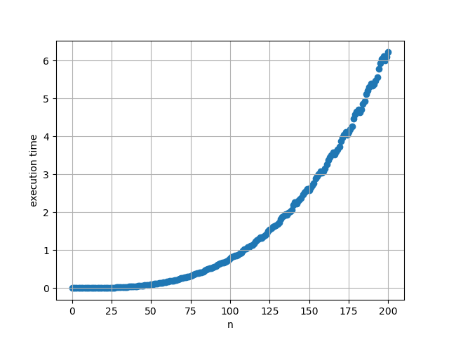
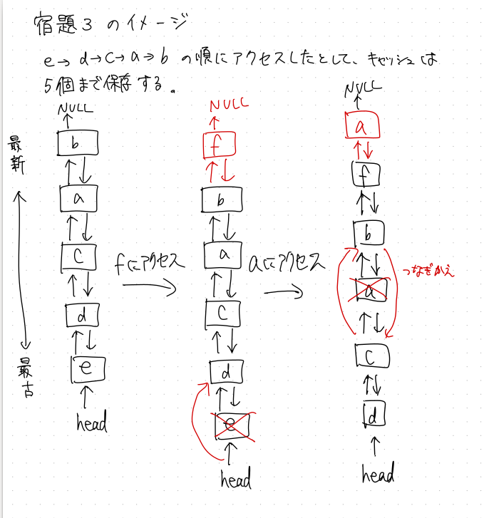

# 宿題1
## matrix.py  
入力Nのときの実行時間を出力するプログラム。  
29行目で行列積を求めている。
```python
for i in range(n): #Aのi行目
    for j in range(n): #Aのj列目、Bのj行目
        for k in range(n): #Bのk列目
            c[i, k] += a[i, j] * b[j, k]
```
行列Aのi行j列と行列Bのj行k列の積を行列Cのi行k列に足している。  
+ 実行方法
```
$ python matrix.py N
```

## matrix-graph.py  
入力がNのときに、行列のサイズを0~Nとしたときの実行時間をそれぞれプロットしたグラフを出力する。例えばN=200のときのグラフは下図のようになる。



行列積を求めるときにはforループを3回回しているので時間計算量はO(n^3)であり、グラフと一致している。

+ 実行方法
```
$ python matrix-graph.py N
```

# 宿題2
現実の大規模なデータベースではハッシュテーブルではなく木構造が使われることが多い理由として以下のものを考えた。
+ ハッシュテーブルは空間計算量が大きいので、実際にデータをすべて自前のメモリ上に置くことが難しいから。大量のメモリを用意すること自体が大変で、費用がかかりすぎるので現実的ではなさそうだと思う。

+ ハッシュテーブルはユーザーの数を事前にある程度予測し、多くなりすぎたらデータベースの再構築が必要となるが、木構造ならユーザー数を事前に考えなくても使えて管理が楽だから。

# 宿題3
双方向リストと組み合わせたらできそうな気がする。

スライドの例を下図のように拡張する。URLを辞書のkeyにして、`[Webペー, 前のURL, 後ろのURL]`のリストをvalueにする？

ハッシュテーブル
|URL|Webページ|前のURL|後ろのURL|
|----|-----|----|----|
|b.com|BBB|a.com|NULL|
|a.com|AAA|c.com|b.com|
|c.com|CCC|d.com|a.com|
|d.com|DDD|e.com|c.com|
|e.com|EEE|head|d.com|


双方向リスト操作のイメージ

    