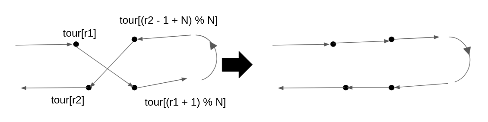

# TSP

## 作成したプログラム
+ [mysolver.py](https://github.com/Gyuchan3/STEP2021/blob/main/class5/mysolver.py)
+ [myoutput_generator.py](https://github.com/Gyuchan3/STEP2021/blob/main/class5/myoutput_generator.py)
  
## 実行方法

```bash
$ python3 myoutput_generator.py
$ python3 output_verifier.py
```

とすると、それぞれのcsvファイルに対する解が表示される。

## mysolver.py
貪欲な方法に2-opt法を追加した。
以下のように、交差している箇所を入れ替えた。



初期状態を変えながら何回かルートを探し、一番良かったものを解とした。